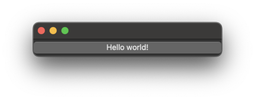

###

<div align="center">


[-fdc009?logo=zig&logoColor=f7a41d&label=Zig)](https://ziglang.org/download/)
</div>

---

Example applications using the [MIT-licensed Qt 6 bindings for Zig](https://github.com/rcalixte/libqt6zig)

These examples can be thought of as instructive templates for using the main library. Though some of the examples have some complexity to them, the intention is to aim for simplicity while demonstrating valid uses of the library. All of source code for the examples are a single file by design. Any auxiliary files are placed in the same directory for either compilation or execution purposes. For a single-application implementation with a simpler build system and limited exercises, check out the [demo](https://github.com/rcalixte/libqt6zig-demo). Please try out the sample applications and start a [discussion](https://github.com/rcalixte/libqt6zig/discussions) if you have any questions or issues relevant to these examples.

---

### TABLE OF CONTENTS

- [License](#license)
- [Building](#building)
- [FAQ](#faq)
  - [Q1. How long does it take to compile the examples?](#q1-how-long-does-it-take-to-compile-the-examples)
  - [Q2. What build modes are supported by the examples?](#q2-what-build-modes-are-supported-by-the-examples)
  - [Q3. Are translations supported?](#q3-are-translations-supported)
  - [Q4. Do the applications built with this library support native styling or theming?](#q4-do-the-applications-built-with-this-library-support-native-styling-or-theming)
- [Special Thanks](#special-thanks)

License
-------

The sample applications within `libqt6zig-examples` are licensed under the MIT license.

Building
--------

The dependencies for building the sample applications are the same as the main library. Refer to the main library's [Building](https://github.com/rcalixte/libqt6zig#building) section for more information.

It is recommended to execute an initial build to generate a clean build cache before making any changes. This allows the build process to use the cached build artifacts to speed up subsequent builds.

Once the required packages are installed, the examples can be built from the root of the repository:

```bash
zig build
```

To build and run all of the examples:

```bash
zig build run
```

Examples in special subdirectories have per-example options that can be used to explicitly enable or disable them:

```bash
zig build -Denable-charts=true -Denable-qscintilla=false
```

In the event that one or more extra library include paths are needed e.g. a locally compiled extra library in a non-standard path, the `extra-paths` option supports this use case:

```bash
zig build -Dextra-paths="C:/Qt/6/llvm-mingw_64"
```

or

```bash
zig build -Dextra-paths={"/opt/qt6","/opt/lib/qt6"}
```

For Windows hosts, there is an additional option to specify the Qt installation directory. This is only required if passing in an alternate extra library path meant to override the default Qt library path:

```bash
zig build -Dextra-paths="C:/Qt/6/llvm-mingw_64" -DQTDIR="C:/Qt/6/llvm-mingw_64"
```

Example applications can also be built and run independently:

```bash
zig build helloworld events
```

Applications can be installed to the system in a non-default location by adding the `--prefix-exe-dir` option to the build command:

```bash
sudo zig build --prefix-exe-dir /usr/local/bin # creates /usr/local/bin/{examples}
```

To see the full list of examples available:

```bash
zig build -l
```

To see the full list of examples and build options available:

```bash
zig build --help
```

The source code for the examples can be found in the `src` directory of the repository.

FAQ
---

### Q1. How long does it take to compile the examples?

The examples compile a subset of the entire main library and then build the sample applications from the source code. The first compilation should take less than 6 minutes, assuming the hardware in use is at or above the level of that of a consumer-grade mid-tier machine released in the past decade. Once the build cache is warmed up for the examples, subsequent compilations should be very fast, on the order of seconds. For client applications that use and configure a specific subset of the main library, the expected compilation time should be similar to the examples.

### Q2. What build modes are supported by the examples?

Currently, only `ReleaseFast`, `ReleaseSafe`, and `ReleaseSmall` are supported. The `Debug` build mode is not supported. This may change in the future. The default build mode is `ReleaseFast`. To change the build mode:

```bash
zig build -Doptimize=ReleaseSafe
```

or

```bash
zig build --release=safe
```

### Q3. Are translations supported?

Several options are available to implement translations ranging from functions available in the main library to well-supported systems such as [GNU gettext](https://www.gnu.org/software/gettext/) to [Qt's internationalization options](https://doc.qt.io/qt-6/internationalization.html). Developers are free to use any of the available options or implement their own solution.

The [lupdate](https://github.com/rcalixte/libqt6zig-examples/tree/master/src/lupdate) example application demonstrates how to use the `lupdate-zig` tool to generate translation files from the source code for use with Qt's translation system.  Refer to the main library's [Tools](https://github.com/rcalixte/libqt6zig#tools) section for more information.

### Q4. Do the applications built with this library support native styling or theming?

<table align="center">

|  |        |
| :--------------------------------------------------------------: | :--------------------------------------------------------------: |
|                        EndeavourOS + KDE                         |                           Fedora + KDE                           |
|    |  |
|                          FreeBSD + Xfce                          |                      Linux Mint + Cinnamon                       |
|                  |              |
|                              macOS                               |                             Windows                              |

</table>

Special Thanks
--------------

- [@mappu](https://github.com/mappu) for the [MIQT](https://github.com/mappu/miqt) bindings that provided the phenomenal foundation for this project

- [@arnetheduck](https://github.com/arnetheduck) for proving the value of collaboration on the back-end of the library while working across different target languages
